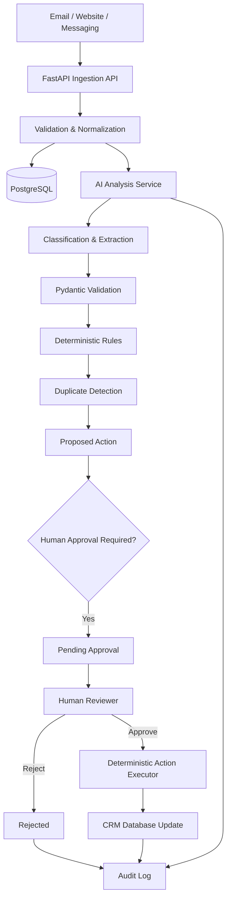

# BEDA AI Systems Assessment — Working Prototype Specification

## Project Name

**AI Enquiry Triage & Human-Approved CRM Workflow**

---

# 1. Project Goal

Build a small but working prototype of an AI-powered business enquiry processing system.

The system receives incoming business enquiries, classifies them, extracts structured information, detects incomplete information and potential duplicate CRM records, proposes the next action, and generates a draft response.

The system must demonstrate one critical principle:

> **AI can reason and recommend, but consequential actions must remain under deterministic control and require human approval when appropriate.**

This prototype should prioritize:

- Simplicity
- Reliability
- Clear separation between AI and deterministic code
- Human-in-the-loop controls
- Auditability
- Failure handling

Do **not** over-engineer the system.

Do not introduce Kafka, Kubernetes, Airflow, microservices, multi-agent frameworks, RAG, or vector databases unless absolutely necessary.

---

# 2. Core User Flow

The complete flow should be:

```text
Incoming Enquiry
        │
        ▼
FastAPI API
        │
        ▼
Input Validation & Normalization
        │
        ▼
Save Raw Enquiry
        │
        ▼
LLM Classification + Structured Extraction
        │
        ▼
Pydantic Schema Validation
        │
        ▼
Deterministic Rules
        │
        ├── Required Fields Check
        ├── Confidence Check
        └── Duplicate Detection
        │
        ▼
Generate Proposed Action
        │
        ▼
Create Pending Approval
        │
        ├──────────────────┐
        ▼                  ▼
Human Approves       Human Rejects
        │                  │
        ▼                  ▼
Execute CRM Action     Record Decision
        │
        ▼
Write Audit Log
```

The system should **never allow the LLM to directly execute arbitrary actions**.

The LLM can only return structured recommendations.

Deterministic application code decides what actions are allowed.

---

# 3. Functional Requirements

## 3.1 Enquiry Ingestion

Implement an API endpoint:

```http
POST /api/v1/enquiries
```

Example request:

```json
{
  "source": "email",
  "sender_name": "John Smith",
  "sender_email": "john@acme.com",
  "message": "Hi, we are interested in AI automation for our customer support team. We are a company with approximately 200 employees."
}
```

Supported sources:

- email
- website
- messaging

The API should:

1. Validate the request.
2. Normalize the incoming data.
3. Store the raw enquiry.
4. Send the enquiry to the AI analysis service.
5. Validate the AI output.
6. Check for duplicate CRM records.
7. Create a proposed action.
8. Return the processing result.

---

# 4. AI Classification

The LLM must classify an enquiry into one of the following categories:

```text
sales
support
junk
insufficient_information
other
```

The model must also return a confidence score between:

```text
0.0 → 1.0
```

Example:

```json
{
  "classification": "sales",
  "confidence": 0.94
}
```

---

# 5. Structured Information Extraction

The LLM should extract useful information where available.

Use a strict structured schema.

Example:

```json
{
  "classification": "sales",
  "confidence": 0.94,

  "contact": {
    "name": "John Smith",
    "email": "john@acme.com",
    "phone": null
  },

  "company": {
    "name": "Acme",
    "size": "200 employees"
  },

  "intent": "Interested in AI automation for customer support",

  "missing_information": [
    "budget",
    "timeline"
  ],

  "recommended_action": "create_or_update_lead"
}
```

Important rules:

- The AI must return `null` when information is not available.
- The AI must never invent a company, phone number, budget, timeline, or other business information.
- Missing information should be explicitly listed.
- All AI output must be validated with Pydantic.

---

# 6. LLM Responsibilities

The LLM should ONLY be responsible for:

```text
✓ Understanding unstructured text
✓ Classifying the enquiry
✓ Extracting structured information
✓ Identifying missing information
✓ Suggesting a next action
✓ Drafting a response
```

The LLM should NOT:

```text
✗ Directly write to the CRM
✗ Delete CRM records
✗ Merge customer records
✗ Send emails
✗ Execute arbitrary tools
✗ Access secrets
✗ Make irreversible decisions
```

---

# 7. Deterministic Code Responsibilities

The following logic must remain deterministic application code:

```text
✓ Input validation
✓ Schema validation
✓ Permission checks
✓ Required field checks
✓ Confidence threshold checks
✓ Duplicate detection
✓ CRM updates
✓ Human approval enforcement
✓ API retry logic
✓ Audit logging
✓ Secret handling
```

The architecture should clearly demonstrate this separation.

---

# 8. Incomplete Information Handling

If required information is missing, the system should not hallucinate or guess.

Example enquiry:

```text
Hi, I'm interested in your services.
```

The AI may classify it as:

```json
{
  "classification": "insufficient_information",
  "confidence": 0.91,
  "missing_information": [
    "company",
    "business_need",
    "contact_details"
  ]
}
```

The system should:

1. Create a proposed follow-up action.
2. Generate a draft clarification response.
3. Mark the action as requiring human approval before sending externally.

Example draft:

```text
Thanks for reaching out. Could you tell us a little more about your company and what problem you are looking to solve?
```

The system must not automatically send this message.

---

# 9. Duplicate Detection

Implement deterministic duplicate detection.

Use the following priority:

## Exact Match

Check:

```text
email
phone
```

If an exact match exists:

```text
duplicate_status = exact_match
```

## Possible Duplicate

If no exact match exists, compare:

```text
name
company name
```

Use a simple deterministic similarity strategy.

For example:

- normalized lowercase strings
- exact normalized company match
- optional string similarity

Do not allow the LLM to automatically merge records.

If a possible duplicate exists:

```text
duplicate_status = possible_duplicate
```

The system should require human review before merging.

---

# 10. CRM Simulation

Do not integrate a real external CRM for the MVP.

Instead, implement a small internal CRM using PostgreSQL.

Create tables:

```text
contacts
companies
enquiries
proposed_actions
audit_logs
```

Suggested relationship:

```text
Company
    │
    └──── Contacts
              │
              └──── Enquiries
                        │
                        └──── Proposed Actions
```

---

# 11. Proposed Actions

The AI can recommend actions, but the application controls execution.

Allowed action types:

```text
CREATE_LEAD
UPDATE_CONTACT
CREATE_SUPPORT_CASE
REQUEST_MORE_INFORMATION
MARK_AS_JUNK
```

Every consequential action should initially have:

```text
status = PENDING_APPROVAL
```

Example:

```json
{
  "action_type": "CREATE_LEAD",
  "status": "PENDING_APPROVAL",
  "requires_human_approval": true
}
```

---

# 12. Human Approval Workflow

Implement:

```http
GET /api/v1/actions
```

Return all pending actions.

Example:

```json
[
  {
    "id": "action_123",
    "type": "CREATE_LEAD",
    "status": "PENDING_APPROVAL"
  }
]
```

Implement:

```http
POST /api/v1/actions/{action_id}/approve
```

When approved:

1. Check permissions.
2. Execute the deterministic CRM action.
3. Update the action status.
4. Create an audit log.

Possible status:

```text
PENDING_APPROVAL
APPROVED
REJECTED
EXECUTED
FAILED
```

Implement:

```http
POST /api/v1/actions/{action_id}/reject
```

Rejected actions must never execute.

---

# 13. Response Drafting

The LLM may generate a draft response.

Example:

```json
{
  "draft_response": "Thanks for reaching out. We'd be happy to learn more about your customer support automation requirements."
}
```

Important:

```text
The draft is NOT automatically sent.
```

For this MVP, simply store the draft inside the proposed action.

Do not implement real email sending.

---

# 14. Confidence Threshold

Implement deterministic confidence rules.

Example:

```python
HIGH_CONFIDENCE = 0.85
```

Logic:

```text
confidence >= 0.85
    → Continue automated processing

confidence < 0.85
    → Flag for human review
```

Even high-confidence results must not bypass human approval for consequential actions.

---

# 15. AI Failure Handling

The application must handle:

- LLM API timeout
- Invalid AI JSON
- Schema validation failure
- Rate limiting
- API failure

Implement retry logic:

```text
Maximum retries: 3
```

Use:

```text
Exponential backoff
```

Example:

```text
Retry 1 → 1 second
Retry 2 → 2 seconds
Retry 3 → 4 seconds
```

If all retries fail:

```text
processing_status = FAILED
```

Create an audit log.

Return a safe error response.

The original enquiry must remain stored.

---

# 16. Audit Logging

Every important event must be recorded.

Examples:

```text
ENQUIRY_RECEIVED

AI_ANALYSIS_STARTED

AI_ANALYSIS_COMPLETED

AI_ANALYSIS_FAILED

DUPLICATE_DETECTED

ACTION_CREATED

ACTION_APPROVED

ACTION_REJECTED

ACTION_EXECUTED

ACTION_FAILED
```

Suggested schema:

```text
audit_logs

id
entity_type
entity_id
event_type
actor_type
actor_id
metadata
created_at
```

Example:

```json
{
  "event_type": "ACTION_APPROVED",
  "actor_type": "human",
  "actor_id": "demo_user",
  "metadata": {
    "action_type": "CREATE_LEAD"
  }
}
```

Never store secrets inside audit logs.

---

# 17. Security and Secrets

Use environment variables.

Provide:

```text
.env.example
```

Example:

```env
DATABASE_URL=
LLM_API_KEY=
LLM_MODEL=
```

Requirements:

```text
✓ Never hardcode API keys
✓ Never expose secrets in API responses
✓ Never log secrets
✓ Use least privilege design
✓ Validate all API inputs
```

For the MVP, implement a simple demo approval identity.

Add comments explaining that production would use:

```text
RBAC
Authentication
Authorization
Secret Manager
```

---

# 18. Cost Control

Design the LLM service to minimize unnecessary calls.

Requirements:

### Do not call the LLM for obvious cases if deterministic rules can handle them.

Example:

```text
Known spam pattern
    ↓
Deterministic filter
    ↓
No expensive LLM call
```

Use:

```text
Small/efficient model for normal classification
```

Optional architecture:

```text
Rules
  ↓
Cheap LLM
  ↓
Escalate only ambiguous cases
```

Implement a simple configuration:

```python
CONFIDENCE_THRESHOLD = 0.85
MAX_RETRIES = 3
MAX_INPUT_LENGTH = 8000
```

---

# 19. Latency Strategy

The MVP can process synchronously.

However, document that a production system could use:

```text
Message Queue
Worker
Async Processing
```

Do not implement unnecessary infrastructure.

The architecture should prioritize:

```text
Simple MVP now
Scalable path later
```

---

# 20. Architecture

The repository must include an architecture diagram.

Use Mermaid.

Create:

```text
docs/architecture.md
```

Include a Mermaid diagram similar to:



---

# 21. Technology Stack

Use:

## Backend

```text
Python
FastAPI
```

## Validation

```text
Pydantic
```

## Database

```text
PostgreSQL
```

## ORM

Use either:

```text
SQLAlchemy
```

or another clean Python ORM.

## AI

Use an LLM provider through a dedicated service abstraction.

Example:

```text
app/services/ai_service.py
```

The application should not tightly couple business logic to a specific LLM provider.

Create an interface/service abstraction so the provider can be replaced later.

---

# 22. Recommended Repository Structure

```text
beda-ai-enquiry-system/

├── README.md
├── requirements.txt
├── .env.example
│
├── app/
│   ├── main.py
│   │
│   ├── api/
│   │   ├── enquiries.py
│   │   └── actions.py
│   │
│   ├── core/
│   │   ├── config.py
│   │   └── logging.py
│   │
│   ├── models/
│   │   ├── database.py
│   │   └── schemas.py
│   │
│   ├── services/
│   │   ├── ai_service.py
│   │   ├── enquiry_processor.py
│   │   ├── duplicate_detector.py
│   │   ├── action_service.py
│   │   └── audit_service.py
│   │
│   └── repositories/
│       ├── enquiry_repository.py
│       ├── crm_repository.py
│       └── audit_repository.py
│
├── docs/
│   ├── architecture.md
│   └── decisions.md
│
└── tests/
    ├── test_enquiries.py
    ├── test_duplicate_detection.py
    └── test_actions.py
```

---

# 23. API Endpoints

Implement the following endpoints.

## Create Enquiry

```http
POST /api/v1/enquiries
```

---

## Get Enquiry

```http
GET /api/v1/enquiries/{enquiry_id}
```

---

## List Pending Actions

```http
GET /api/v1/actions?status=PENDING_APPROVAL
```

---

## Approve Action

```http
POST /api/v1/actions/{action_id}/approve
```

---

## Reject Action

```http
POST /api/v1/actions/{action_id}/reject
```

---

## Health Check

```http
GET /health
```

Response:

```json
{
  "status": "healthy"
}
```

---

# 24. Important Implementation Example

The main processing flow should conceptually work like this:

```python
def process_enquiry(enquiry):

    save_raw_enquiry(enquiry)

    analysis = ai_service.analyse(enquiry)

    validated_analysis = validate_ai_output(analysis)

    if validated_analysis.confidence < CONFIDENCE_THRESHOLD:
        create_human_review_action(
            enquiry=enquiry,
            reason="Low AI confidence"
        )

        return

    duplicate = duplicate_detector.find_duplicate(
        email=validated_analysis.contact.email,
        phone=validated_analysis.contact.phone,
        name=validated_analysis.contact.name,
        company=validated_analysis.company.name
    )

    proposed_action = action_service.create_proposed_action(
        enquiry=enquiry,
        analysis=validated_analysis,
        duplicate=duplicate,
        status="PENDING_APPROVAL"
    )

    audit_service.log(
        event="ACTION_CREATED",
        entity_id=proposed_action.id
    )

    return proposed_action
```

Important:

The AI must never directly call:

```python
crm.create_contact()
```

Instead:

```text
AI Recommendation
       ↓
Proposed Action
       ↓
Human Approval
       ↓
Deterministic Executor
       ↓
CRM Update
```

---

# 25. README Requirements

The README must be written as an assessment submission, not merely software documentation.

It should include:

## Problem

Briefly explain the business problem.

## Architecture

Include Mermaid architecture.

## Data Flow

Explain the end-to-end flow.

## Model and Tool Choices

Explain:

- Why an LLM is used
- Why deterministic code is used
- Why PostgreSQL is used
- Why human approval exists

## LLM vs Deterministic Code

Include a table.

Example:

| Responsibility | LLM | Deterministic Code |
|---|---|---|
| Understand enquiry | Yes | No |
| Classification | Yes | Optional rules |
| Extract information | Yes | Validation |
| Duplicate detection | No | Yes |
| Permission checks | No | Yes |
| CRM updates | No | Yes |
| Draft response | Yes | No |
| Send consequential communication | No | Human approval |

## Failure Handling

Explain:

- Incomplete information
- Hallucination
- Duplicate records
- Model failure
- API failure

## Security

Explain:

- Secrets
- Permissions
- Sensitive data
- Least privilege

## Cost and Latency

Explain:

- Rule-based filtering
- Efficient models
- Escalation strategy
- Input limits

## Deliberately Not Automated

State clearly:

> The system deliberately refuses to autonomously send externally binding communications or perform irreversible CRM changes without appropriate human approval.

## Prototype Scope

Explain that this repository intentionally implements the critical control path rather than building unnecessary infrastructure.

---

# 26. Testing Requirements

Implement basic tests for:

### Enquiry Validation

```text
Invalid input should be rejected.
```

### AI Output Validation

```text
Invalid AI structured output should fail safely.
```

### Duplicate Detection

```text
Same email should detect an exact duplicate.
```

### Human Approval

```text
A proposed action must not execute before approval.
```

### Rejection

```text
Rejected actions must never execute.
```

---

# 27. UI

Do not spend significant time building a frontend.

The API documentation generated by FastAPI:

```text
/docs
```

is sufficient.

Optional:

A very minimal HTML interface may be added only if it is quick and does not distract from the core system.

The focus is backend and AI systems reasoning.

---

# 28. Quality Requirements

The final implementation must be:

```text
✓ Runnable
✓ Simple
✓ Clean
✓ Well structured
✓ Demonstrably safe
✓ Easy to understand
✓ Not over-engineered
```

Prioritize:

```text
Clear architecture
```

over:

```text
More features
```

Prioritize:

```text
Correct controls
```

over:

```text
Autonomous AI behavior
```

---

# 29. Final Deliverables

The completed repository must contain:

```text
✓ Working FastAPI application
✓ PostgreSQL integration
✓ AI service abstraction
✓ Structured AI output
✓ Pydantic validation
✓ Duplicate detection
✓ Human approval workflow
✓ Deterministic action execution
✓ Audit logs
✓ Basic tests
✓ Architecture documentation
✓ Assessment-focused README
✓ .env.example
```

---

# 30. Final Instruction to the Implementer

Build this as a **small, robust AI systems prototype**.

Do not attempt to build a full CRM.

Do not add unnecessary infrastructure.

The strongest demonstration should be this principle:

> **The LLM can understand, extract, reason, and recommend. Deterministic code controls permissions, validation, execution, and consequential actions. Humans remain in control where appropriate.**

The implementation should make this principle visible throughout the architecture, code structure, API design, and README.