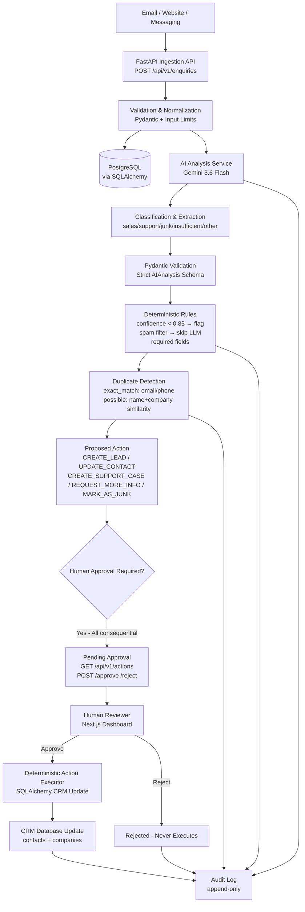
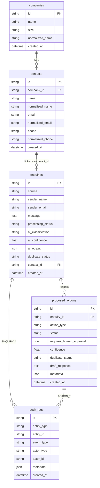

# Architecture — InboxOps AI

## Overview

InboxOps AI is a **Human-in-the-Loop** enquiry processing prototype that demonstrates:

> **LLM can understand, extract, reason and recommend. Deterministic code controls permissions, validation, execution and consequential actions. Humans remain in control where appropriate.**

The system ingests business enquiries (email/website/messaging), classifies them with Gemini 3.6 Flash, extracts structured data, checks deterministic rules, proposes an action, and requires human approval before any CRM mutation.

## High-Level Flow



## Component Map

```
bedafolder/
├── app/
│   ├── main.py                 # FastAPI app, CORS, /health, /docs
│   ├── api/
│   │   ├── enquiries.py        # POST /enquiries, GET /enquiries/{id}
│   │   └── actions.py          # GET /actions, POST /{id}/approve|reject
│   ├── core/
│   │   ├── config.py           # Settings from env (never hardcode secrets)
│   │   └── logging.py
│   ├── models/
│   │   ├── database.py         # SQLAlchemy models: companies, contacts, enquiries, proposed_actions, audit_logs
│   │   └── schemas.py          # Pydantic schemas + AIAnalysis strict validation
│   ├── services/
│   │   ├── ai_service.py       # Gemini 3.6 Flash abstraction + mock + retry 3× exponential backoff
│   │   ├── enquiry_processor.py# Main flow: save_raw → AI → validate → duplicate → propose
│   │   ├── duplicate_detector.py# Deterministic similarity (normalized email/phone/name/company)
│   │   ├── action_service.py   # Create/Approve/Reject/Execute (deterministic CRM)
│   │   └── audit_service.py    # Append-only logs, secret redaction
│   └── repositories/           # (thin, via SQLAlchemy directly for MVP)
├── frontend/                   # Next.js 14 App Router (TypeScript + Tailwind)
│   ├── app/
│   │   ├── page.tsx            # Dashboard: Ingest | Queue | Enquiries | Audit | CRM
│   │   └── layout.tsx
│   └── lib/api.ts              # Fetch wrapper to FastAPI
├── docs/
│   ├── architecture.md         # This file
│   └── decisions.md            # Trade-offs
└── tests/
    ├── test_enquiries.py
    ├── test_duplicate_detection.py
    └── test_actions.py
```

## Data Model



## Separation of Concerns

| Concern | Owner | Why |
|---|---|---|
| Understanding unstructured text, classification, extraction, missing info, draft | **LLM (Gemini 3.6 Flash)** | Language understanding; flexible reasoning |
| Input validation, schema validation, permission checks, confidence threshold, duplicate detection, CRM updates, approval enforcement, retry, audit, secrets | **Deterministic Python** | Safety, auditability, reproducibility, no hallucination |

## Failure & Cost Strategy

- **Spam filter first**: deterministic keyword list skips LLM (cost control)
- **Input limit 8000**: truncate before LLM
- **Model choice**: Gemini 3.6 Flash = small/efficient; escalation path documented (rules → cheap LLM → escalate ambiguous)
- **Retry 3× exponential backoff**: 1s, 2s, 4s for timeout/rate-limit/invalid JSON
- **On failure**: `processing_status=FAILED`, audit `AI_ANALYSIS_FAILED`, original enquiry retained
- **Sync for MVP**: FastAPI handles synchronously; production path noted as `Queue + Worker + Async`
- **No auto-send**: Draft stored inside proposed_action, never emailed automatically

## Security

- Secrets via `DATABASE_URL`, `GEMINI_API_KEY`, `GEMINI_MODEL` from `.env` / env vars; never hardcoded/logged
- Audit log redacts keys/secrets
- CORS limited to `FRONTEND_URL`
- Demo actor `demo_user` with comment that production uses RBAC/OAuth/Secret Manager
- Least privilege: AI cannot access secrets, delete/merge records, or execute tools

## Latency & Scaling Path

- **MVP**: synchronous (simple, debuggable)
- **Production**: `API → Message Queue → Worker → Async callback` + `Vector DB/RAG` only if needed; not over-engineered now

## Frontend

Next.js consumes FastAPI via `NEXT_PUBLIC_API_URL`. Pages: Ingest form, Approval Queue (approve/reject), Enquiries table, Audit timeline, CRM contacts. Dark operational theme with teal accent; shows confidence, duplicate badges, missing info, draft preview.

